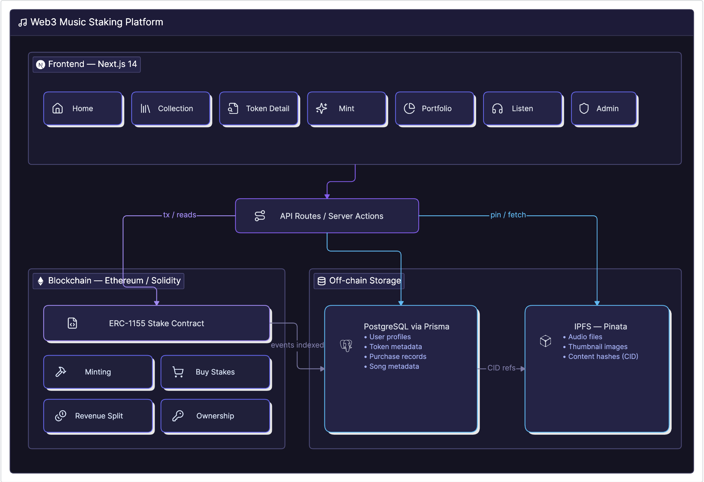

<p align="center">
  
  
  
  
  
  
</p>

# 🎵 SoundStake

**A decentralized music staking platform where fans invest in artists by purchasing fractional ownership tokens, and earn a share of the song's revenue — all powered by smart contracts on Ethereum.**

> Artists tokenize their unreleased music as ERC-1155 NFTs → Fans buy fractional stakes with ETH → Song gets released → Revenue is distributed proportionally on-chain.

<p align="center">
  <a href="https://soundstake.vercel.app">🌐 Live Demo</a> •
  <a href="https://sepolia.etherscan.io/address/0x8F3F72cf1B82230C8f9120eCF1Fd96bf1C469CDc">📜 Smart Contract on Etherscan</a>
</p>

---

## 📌 Problem Statement

The music industry suffers from an **opaque revenue model**. Artists receive as little as 15–20% of streaming revenue, with the rest absorbed by labels, distributors, and platforms. Fans, despite being the primary consumers, have **zero financial stake** in the music they help make successful.

**SoundStake** flips this model: artists raise capital directly from their fan base by selling tokenized stakes in their music, and fans earn proportional revenue — all enforced transparently by smart contracts with no intermediaries.

---

## 🏗️ Architecture

<p align="center">
  
</p>


### Why Hybrid Architecture?

| Layer | Technology | Stores | Why |
|---|---|---|---|
| **Blockchain** | Solidity / ERC-1155 | Ownership, balances, revenue, payouts | Trustless, immutable, verifiable |
| **Database** | PostgreSQL (Neon) | User profiles, token names, descriptions, images | Fast reads, complex queries, UI metadata |
| **IPFS** | Pinata | Audio files, thumbnails | Decentralized, content-addressed, permanent |

> Blockchain is the **source of truth** for all financial operations. The database is a **read-optimized mirror** for UI performance. IPFS provides **censorship-resistant media storage**.

---

## 🔗 Smart Contract — `Fein.sol`

**Deployed on Sepolia Testnet:** [`0x8F3F72cf1B82230C8f9120eCF1Fd96bf1C469CDc`](https://sepolia.etherscan.io/address/0x8F3F72cf1B82230C8f9120eCF1Fd96bf1C469CDc)

The `Fein` contract extends OpenZeppelin's **ERC-1155** (multi-token standard), enabling multiple token types within a single contract. Each token type represents a different song's fractional ownership.

### Core Functions

| Function | Access | Description |
|---|---|---|
| `mintNFT(supply, amount, share)` | Artist | Creates a new token type representing a song. Mints `supply` tokens at a total valuation of `amount` ETH. |
| `buyStake(tokenId, number)` | Public | Fans purchase `number` of tokens by sending the required ETH. Automatically tracks participants and marks sold-out tokens. |
| `releaseSong(tokenId)` | Artist | Marks a song as "released", enabling revenue operations. |
| `addRevenueGen(tokenId)` | Admin | Injects ETH into the contract to simulate streaming revenue for a specific token. |
| `artistTokenSales(tokenId)` | Admin | Transfers accumulated sale funds to the artist's wallet. Follows checks-effects-interactions pattern. |
| `distributeRevenue(tokenId)` | Admin | Splits accumulated revenue between the artist and all token holders based on their `percentageShare` and fractional ownership. |

### Revenue Distribution Formula

```
investorPool = revenue × percentageShare / 100
artistPool   = revenue - investorPool

For each investor:
  payout = investorPool × (tokensHeld / totalTokenSupply)
```

---

## 🗃️ Database Schema

```
User ─┬── UserInfo (1:1)      Profile name, Instagram
      ├── Song[] (1:N)         Uploaded audio metadata
      ├── MintedToken[] (1:N)  Tokens the user created (as artist)
      ├── BoughtToken[] (1:N)  Tokens the user purchased (as investor)
      ├── Like[] (1:N)         Liked songs
      └── Follower[] (M:N)     Social following

MintedToken ── BoughtToken[] (1:N)  Purchase records per token
Song ── Like[] (1:N)                Likes per song
```

---

## ✨ Features

### 🎨 For Artists
- **Mint Tokens** — Tokenize your unreleased music as ERC-1155 NFTs with configurable supply, price, and revenue share percentage.
- **Upload Songs** — Upload audio files and thumbnails to IPFS for decentralized, permanent storage.
- **Release Songs** — Mark songs as released to unlock revenue distribution.
- **Portfolio Dashboard** — View all your minted tokens, release status, and manage your catalog.

### 💰 For Investors (Fans)
- **Browse Collection** — Discover available music tokens on the marketplace.
- **Buy Stakes** — Purchase fractional ownership by sending ETH directly to the smart contract.
- **Earn Revenue** — Receive proportional payouts when the admin distributes streaming revenue.
- **Portfolio Tracking** — View all your purchased tokens and ownership details.

### 🎧 Platform
- **Music Player** — Stream songs directly from IPFS with a custom audio player (play/pause, volume, scrubbing).
- **MetaMask Authentication** — Wallet-based login with JWT session management. No passwords.
- **Admin Dashboard** — Three-step revenue lifecycle management (Token Sales → Add Revenue → Distribute).

---

## 🛠️ Tech Stack

| Category | Technology | Purpose |
|---|---|---|
| **Frontend** | Next.js 14 (App Router) | Server-side rendering, API routes, file-based routing |
| **Styling** | Tailwind CSS + MUI | Rapid UI development with component library |
| **Smart Contract** | Solidity 0.8.20 | ERC-1155 token logic, revenue distribution |
| **Contract Tooling** | Hardhat | Compilation, deployment, local blockchain |
| **Blockchain** | Ethereum (Sepolia Testnet) | Decentralized execution layer |
| **Database** | PostgreSQL (Neon) | Serverless, auto-scaling relational database |
| **ORM** | Prisma | Type-safe database queries, schema management |
| **File Storage** | IPFS via Pinata | Decentralized, content-addressed media hosting |
| **Auth** | MetaMask + JWT | Wallet-based authentication with session tokens |
| **State Management** | ethers.js v5 | Ethereum provider, contract interactions, BigNumber math |

---

## 🚀 Getting Started

### Prerequisites

- Node.js 18+
- MetaMask browser extension
- Sepolia testnet ETH ([faucet](https://sepoliafaucet.com/))

### Installation

```bash
# Clone the repository
git clone https://github.com/YOUR_USERNAME/SoundStake.git
cd SoundStake

# Install dependencies
npm install

# Set up environment variables
cp .env.example .env
# Fill in DATABASE_URL, SEPOLIA_PRIVATE_KEY, and Pinata credentials
```

### Environment Variables

| Variable | Description |
|---|---|
| `DATABASE_URL` | Neon PostgreSQL connection string |
| `SEPOLIA_PRIVATE_KEY` | Wallet private key for contract deployment |

### Database Setup

```bash
# Push schema to database
npx prisma db push

# Open Prisma Studio (optional, for visual DB management)
npx prisma studio
```

### Local Development

```bash
# Start the local Hardhat blockchain
npx hardhat node

# Deploy the contract (in a new terminal)
npm run local:redeploy

# Start the Next.js dev server (in a new terminal)
npm run dev
```

### Testnet Deployment

```bash
# Deploy to Sepolia (requires Sepolia ETH in your wallet)
npm run sepolia:redeploy
```

---

## 📁 Project Structure

```
SoundStake/
├── contracts/
│   └── Fein.sol                 # ERC-1155 smart contract
├── scripts/
│   └── deploy.js                # Hardhat deployment script
├── prisma/
│   └── schema.prisma            # Database schema
├── src/
│   ├── app/
│   │   ├── page.tsx             # Home — featured tokens
│   │   ├── collection/          # All available tokens
│   │   ├── token/[tokenId]/     # Token detail + buy
│   │   ├── mint/                # Artist: create new token
│   │   ├── uploadsong/          # Artist: upload audio to IPFS
│   │   ├── portfolio/[address]/ # User portfolio
│   │   ├── listen/              # Music player
│   │   ├── onboard/[address]/   # Profile setup
│   │   ├── admin/               # Revenue management
│   │   └── api/                 # API routes
│   ├── components/
│   │   ├── Navbar.tsx           # Navigation + wallet connect
│   │   ├── Listen.tsx           # Audio player component
│   │   └── cards/               # Token cards, admin cards
│   ├── lib/
│   │   ├── ipfs.ts              # Pinata SDK configuration
│   │   ├── prisma.ts            # Prisma client singleton
│   │   └── actions/             # Server actions (token, user, song)
│   └── contract_data/           # Compiled ABI + deployed address
├── hardhat.config.js            # Network configuration
└── package.json
```

---

## 🔄 User Flow

```
Artist                              Fan/Investor                    Admin
  │                                      │                            │
  ├─ Connect MetaMask                    ├─ Connect MetaMask          │
  ├─ Complete Onboarding                 ├─ Browse /collection        │
  ├─ Upload image to IPFS (/mint)        ├─ View token details        │
  ├─ Mint ERC-1155 tokens on-chain       ├─ Buy stakes with ETH       │
  ├─ Upload song to IPFS (/uploadsong)   ├─ View portfolio            │
  ├─ Release song on-chain               ├─ Listen to music           │
  │                                      │                            │
  │                                      │         ┌──────────────────┤
  │                                      │         │ 1. artistTokenSales
  │  ◄─── Receives sale funds ───────────┼─────────┤ 2. addRevenueGen
  │                                      │  ◄──────┤ 3. distributeRevenue
  │                                      │         └──────────────────┘
  │  ◄─── Receives artist share          │
  │                                      ├─ Receives investor share
```

---

## ⚠️ Known Limitations & Future Work

| Limitation | Current State | Proposed Improvement |
|---|---|---|
| **Simulated Revenue** | Admin manually injects ETH to simulate streaming income | Integrate with a streaming oracle or off-chain revenue feed via Chainlink |
| **Song ↔ Token Decoupled** | `Song` and `MintedToken` models have no foreign key relationship | Add `tokenId` field to `Song` schema to link audio metadata with its on-chain token |
| **No Automated Tests** | Manual testing only | Add Hardhat tests for contract + Jest/Playwright for frontend |
| **Hardcoded Admin Address** | Admin access is a single hardcoded wallet address | Implement OpenZeppelin's `AccessControl` for role-based permissions |
| **No Secondary Market** | Investors cannot resell their tokens to other users | Build a peer-to-peer marketplace using ERC-1155's built-in `safeTransferFrom` |

> These are intentional design decisions for the current scope. Each limitation has a clear path to resolution, demonstrating architectural awareness.

---

## 📜 License

This project is for educational and portfolio purposes.

---
<!-- 
## Screenshots
Take screenshots of these pages and add them to a /screenshots folder:
1. Home page (with token cards)
2. Mint page (with form filled)  
3. Token detail page (with buy button)
4. Portfolio page
5. Music player (/listen)
6. Admin dashboard (with the 3-step dialog open)

Then add them to the README like:
## 📸 Screenshots
<p align="center">
  
  
</p> 
-->